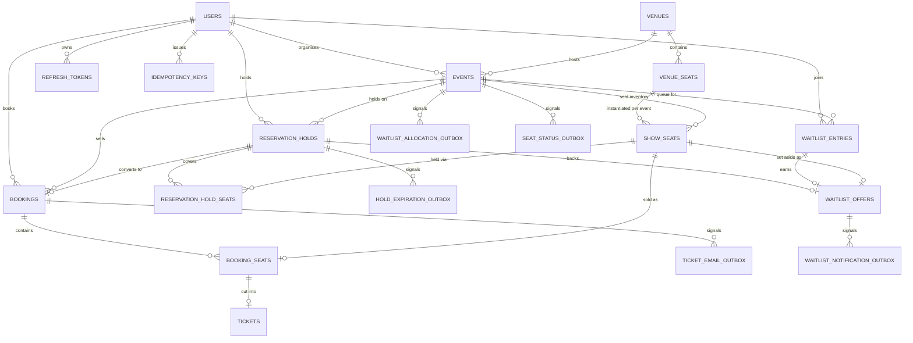

# Database schema

PostgreSQL is the single source of truth for every fact this system cares
about — seat ownership, hold/booking/waitlist state, idempotency, refresh
tokens. Redis is used only as a cache/signal layer (rate limiting, expiry
notifications, real-time fan-out); nothing in Redis is ever authoritative,
and the schema below is designed so that deleting every Redis key changes no
seat's availability. See [SYSTEM_DESIGN.md](SYSTEM_DESIGN.md) for why.

Conventions applied throughout every migration in `migrations/`:

- UUID primary keys (`gen_random_uuid()`)
- `timestamptz` columns; every connection runs with `timezone=UTC`
- `CHECK` constraints for enum-like columns instead of PostgreSQL enum types,
  so a new value is a migration, not an `ALTER TYPE`
- foreign keys with a deliberate `ON DELETE` behaviour per relationship
  (`CASCADE` for data that means nothing without its parent, `RESTRICT` for
  financial/historical records, `SET NULL` for a traceable-but-optional link)
- `updated_at` maintained by a shared `set_updated_at()` trigger, not by
  application code
- partial unique indexes to express "at most one *live* X" without a
  denormalised status column drifting from the truth

## Entity relationship diagram



## Tables

### `users`

The account for every role — `customer`, `organiser`, `admin` (`users_role_check`).
`password_hash` is Argon2id; no plaintext password ever reaches the database.

| Column | Notes |
| --- | --- |
| `email` | unique **case-insensitively** via `users_email_lower_key` (`CREATE UNIQUE INDEX ... ON users ((lower(email)))`), not a plain unique constraint |
| `role` | `CHECK role IN ('customer','organiser','admin')` |
| `name` | `CHECK char_length(btrim(name)) > 0` |

### `venues` / `venue_seats`

The physical world. A venue's seats are laid out once and reused across every
event held there.

- `venues.city` (nullable, added for discovery) — unfilled for venues created
  before city was tracked; a venue with no recorded city simply never matches
  a city filter.
- `venue_seats`: `(venue_id, row_label, seat_number)` is `UNIQUE`
  (`venue_seats_venue_row_seat_key`) — one physical seat exists once.
  `category` is `CHECK IN ('standard','premium')`.

### `events`

A movie screening or concert/show. `event_type` (`movie`/`concert`) is the
medium; `category` (`music`/`comedy`/`sports`/`theatre`/`other`) is the
browse genre added for discovery — two independent vocabularies.

| Column | Notes |
| --- | --- |
| `organiser_id` | `REFERENCES users(id) ON DELETE RESTRICT` — a durable record; deleting an organiser with events must fail loudly, not cascade |
| `venue_id` | `ON DELETE RESTRICT`, same reasoning |
| `status` | `CHECK IN ('draft','published','cancelled','completed')` |
| `currency` | `CHECK currency ~ '^[A-Z]{3}$'` |
| `search_vector` | `tsvector GENERATED ALWAYS AS (...) STORED`, weighted title (A) > category (B) > description (C); indexed with GIN (`events_search_vector_gin_idx`) for full-text search |
| `events_time_range_check` | `ends_at > starts_at` |

Indexes: `organiser_id`, `venue_id`, `starts_at`, and the composite
`(status, starts_at)` that serves "published events, soonest first" — the
core discovery query — directly.

### `show_seats`

The per-event inventory state of one physical seat —
`venue_seats` = the seat exists; `show_seats` = its state for *this* event.

- `(event_id, venue_seat_id)` `UNIQUE` — exactly one inventory row per
  physical seat per event.
- `status` — `CHECK IN ('available','held','booked')`. **This column, plus
  `reservation_holds`, is the entire authority on seat ownership.** No other
  table or cache ever decides it.
- `price NUMERIC(12,2)`, `CHECK price >= 0` — set per event from the
  organiser's pricing map at creation; a booking snapshots it into
  `booking_seats.price` at confirmation, so a later repricing never touches
  what a customer already paid.
- `seat_version BIGINT` — bumped by a trigger (see below) on every status
  change; lets a WebSocket client discard a stale or duplicated message.

### `reservation_holds` / `reservation_hold_seats`

A customer's temporary claim on one or more seats of one event.

- `reservation_holds.status` — `CHECK IN ('active','expired','converted','cancelled')`.
- `expires_at` is a plain column, not a `CHECK` against `now()` — a `CHECK`
  is evaluated on write, not continuously, so it cannot express "still valid
  right now." Expiry is domain logic reading a timestamp.
- Partial index `reservation_holds_active_expires_at_idx` on `expires_at`
  `WHERE status = 'active'` — the expiry sweep's only index; it never grows
  with rows the sweep can no longer match.
- `reservation_hold_seats` is a pure junction: `PRIMARY KEY (hold_id, show_seat_id)`,
  both columns `ON DELETE CASCADE`. It carries no `user_id`/`event_id` — both
  are reachable through `hold_id`, and duplicating them would let two copies
  of the truth drift.
- **No `hold_id` column on `show_seats`, and no partial unique index
  forbidding two active holds on one seat.** Concurrency is decided by row
  locks in the reservation service, not by storage — see
  [SYSTEM_DESIGN.md](SYSTEM_DESIGN.md).

### `idempotency_keys`

Makes a retried write safe to repeat. `UNIQUE (user_id, key)` is the actual
synchronisation primitive a concurrent duplicate blocks on — see
[SYSTEM_DESIGN.md](SYSTEM_DESIGN.md) for the full mechanism.

| Column | Notes |
| --- | --- |
| `request_hash` | SHA-256 of the request's meaningful fields; a key reused for a materially different request is refused, not replayed |
| `status` | `CHECK IN ('processing','completed')` |
| `idempotency_keys_completed_has_response_check` | `status <> 'completed' OR (response_status IS NOT NULL AND response_body IS NOT NULL)` — a `completed` row must actually carry what it promises to replay |

### `bookings` / `booking_seats`

The durable result of confirming a hold.

- `bookings.status` — `CHECK IN ('confirmed','cancelled')`. This is a booking
  lifecycle, not a payment lifecycle — no payment integration exists (see
  [ARCHITECTURE.md](ARCHITECTURE.md)/README), so no payment states are
  modelled.
- `bookings_hold_id_key` — `UNIQUE (hold_id)`: **the constraint that makes
  double-confirmation structurally impossible**, not merely unlikely. Row
  locks serialise concurrent confirmations, but this holds even if that logic
  is ever wrong.
- `bookings.user_id`/`event_id`/`hold_id` are all `ON DELETE RESTRICT` — a
  booking is a financial record and must not silently disappear.
- `total_amount NUMERIC(12,2)` — the sum of `booking_seats.price`, computed
  and written by PostgreSQL (`SUM(...)`), never by application arithmetic.
- `booking_seats.cancelled_at` (nullable timestamptz) — `NULL` means "still
  sold under this booking." The replacement for a plain
  `UNIQUE(show_seat_id)` once cancellation could re-release a seat: a partial
  unique index `booking_seats_live_show_seat_key` on `show_seat_id`
  `WHERE cancelled_at IS NULL` expresses "at most one **live** booking per
  seat" without a status column on another table.

### `tickets`

The entry credential a confirmed booking earns — one per `booking_seats` row,
not per booking.

- `tickets_booking_seat_id_key` — `UNIQUE (booking_seat_id)`: exactly one
  ticket is ever cut for a given sold seat, enforced unconditionally (unlike
  `booking_seats`' own constraint, there is no cancel-and-reissue lifecycle).
- `status` — `CHECK IN ('issued','used','void')`.
- `tickets_used_at_consistency_check` — `(status = 'used') = (used_at IS NOT NULL)`.
- `ticket_reference` — public, high-entropy, unique; never the row's own
  UUID. This is what a QR code and a support call are allowed to carry.

### `waitlist_entries` / `waitlist_offers`

A customer's queue position for a sold-out event+category, and the
time-limited offer they get when a seat opens up. See
[SYSTEM_DESIGN.md](SYSTEM_DESIGN.md) for the full flow — **an offer wraps one
`reservation_holds` row** (`waitlist_offers.hold_id`, `UNIQUE`) rather than
re-implementing expiry.

- `waitlist_entries.status` — `CHECK IN ('waiting','offered','accepted','expired','cancelled')`.
- `waitlist_entries_active_membership_key` — `UNIQUE (event_id, user_id, seat_category)`
  `WHERE status IN ('waiting','offered')`: the database-enforced guard
  against joining the same queue twice while already active.
- `waitlist_entries_waiting_fifo_idx` — `(event_id, seat_category, joined_at, id)`
  `WHERE status = 'waiting'`: the FIFO candidate scan's index; `id` breaks
  ties on an identical `joined_at`.
- `waitlist_offers.status` — `CHECK IN ('offered','accepted','expired')` — no
  `cancelled` state, because no path in this system ever revokes a live
  offer other than by it lapsing.
- `waitlist_offers_active_seat_key` / `waitlist_offers_active_entry_key` —
  partial unique indexes, `WHERE status = 'offered'`: at most one live offer
  per seat and per entry. Backstops, not the primary defence — the seat's own
  row lock inside hold creation is what actually prevents a conflict.

### `waitlist_allocation_outbox` / `waitlist_notification_outbox`

Two durable signal tables, both outboxes in the same pattern as
`hold_expiration_outbox` below.

- `waitlist_allocation_outbox` — "go look at this event+category"; coalesced
  via a partial unique index `(event_id, seat_category) WHERE processed_at IS NULL`
  so repeat signals for the same still-pending pair collapse into one row.
- `waitlist_notification_outbox` — "tell this user their offer was created or
  expired." **Produced but never consumed**: no worker sends these
  notifications. `payload` (`jsonb`) carries only safe identifiers (offer id,
  entry id, user id, event id, seat id, expiry) — nothing a credential could
  be built from.

### `hold_expiration_outbox` / `ticket_email_outbox` / `seat_status_outbox`

Three more outboxes, one per worker, all the same shape: `processed_at`,
`attempts`, `last_error`, `available_at` (when the row may next be
attempted — pushed forward on retry by an exponential backoff **computed by
PostgreSQL**, never by the worker's own clock). Each has a partial index on
`available_at WHERE processed_at IS NULL`, claimed with
`FOR UPDATE SKIP LOCKED` — see [SYSTEM_DESIGN.md](SYSTEM_DESIGN.md).

| Table | One row per | Consumed by |
| --- | --- | --- |
| `hold_expiration_outbox` | hold (`UNIQUE hold_id`) | `npm run worker` (publish loop) |
| `ticket_email_outbox` | booking (`UNIQUE booking_id`) | `npm run worker` (ticket-email loop) |
| `seat_status_outbox` | seat status transition (unqualified — every transition is a distinct event) | `npm run worker:realtime` |

`seat_status_outbox` additionally carries `event_type`
(`SEAT_HELD`/`SEAT_RELEASED`/`SEAT_BOOKED`) and `seat_version`, both computed
by the `emit_seat_status_event()` trigger on `show_seats` — see
`migrations/1787518800000_realtime-seat-status.ts`. This is the one outbox
populated by a database trigger rather than application-code `INSERT`s,
because it has six call sites across four services and a trigger encodes the
rule once, at the data, instead of copying it into every caller.

### `refresh_tokens`

Durable, revocable sessions. Only `token_hash` (SHA-256 of the raw token) is
stored — never the token itself. `rotated_from` (`ON DELETE SET NULL`) chains
each rotation to the token it replaced, so reuse of an already-rotated token
is detected and answered by revoking the whole chain, not just refused.

## State machines

```
reservation_holds.status:  active ──> converted   (booking confirmed)
                               │
                               ├──> expired        (sweep, or reclaimed by a new hold request)
                               └──> cancelled

bookings.status:            confirmed ──> cancelled

tickets.status:              issued ──> used
                                 └────> void

waitlist_entries.status:    waiting ──> offered ──> accepted
                                │            └────> expired
                                └──> cancelled

waitlist_offers.status:      offered ──> accepted
                                 └────> expired
```

Every transition above is a single guarded `UPDATE ... WHERE status = '<from>'`.
A repeated transition matches zero rows and is treated as a refusal (409),
never assumed to be a success — the same discipline throughout the schema.

## Why PostgreSQL is the source of truth

Every fact that decides who owns a seat, whether a request has already been
handled, or whether a token is still valid lives in a PostgreSQL row, behind
a row lock or a unique constraint that PostgreSQL itself enforces. Redis
holds derived signals only — a rate-limit counter, an expiry-timer key, a
pub/sub fan-out for the WebSocket layer — every one of which can be deleted
entirely without corrupting a single seat, booking, or ticket. See
[SYSTEM_DESIGN.md](SYSTEM_DESIGN.md) for the concurrency and outbox mechanics
that this guarantees.
